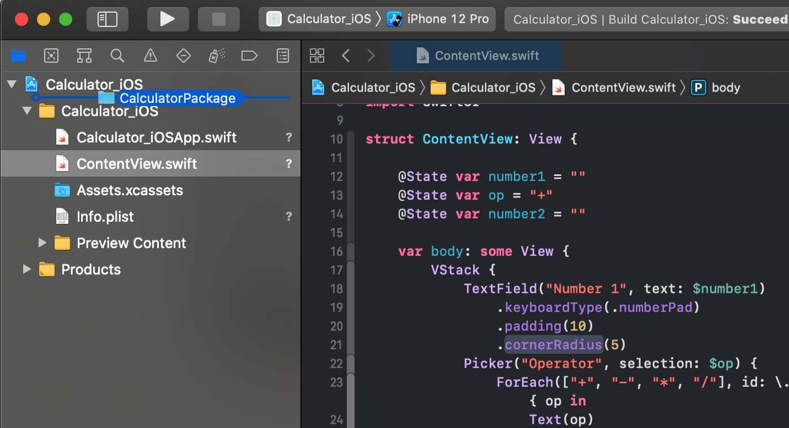
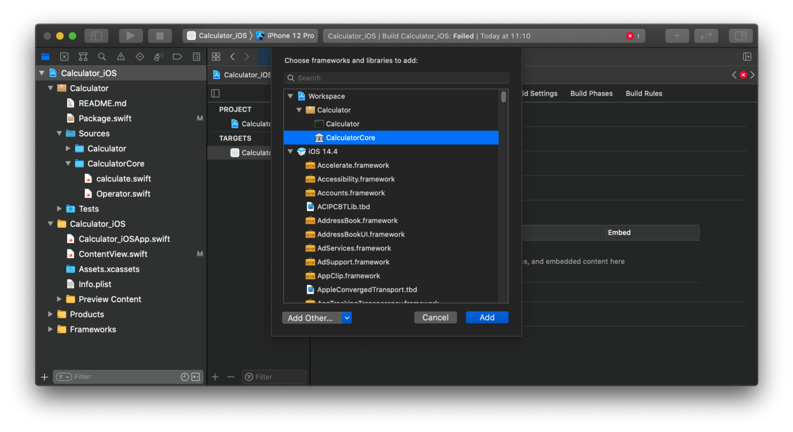

# Article

[https://itnext.io/modularize-xcode-projects-using-local-swift-packages-8fd844c19081](https://itnext.io/modularize-xcode-projects-using-local-swift-packages-8fd844c19081)

# Init

```bash
$ swift package init --type executable
```

# #1 Create Directory Structure

- Sources
    - package.swift
    - README.md
    - Calculator
        - main.swift
    - CalculatorCore
        - Operator.swift
        - calculate.swift
        
        ⇒ must be defined with `public`
        

# #2 Source Code

... this depends on what you build

# #3 package.swift

```swift
let package = Package(
    name: "Calculator",
    products: [
        .library(name: "CalculatorCore", 
                 targets: ["CalculatorCore"])
    ],
    targets: [
        .target(name: "CalculatorCore"),
        .target(name: "Calculator",
                dependencies: ["CalculatorCore"]),
        .testTarget(name: "CalculatorTests",
                    dependencies: ["Calculator"]),
    ]
)
```

# #4 Add to framework

### Drag and Drop



### Add to framework

